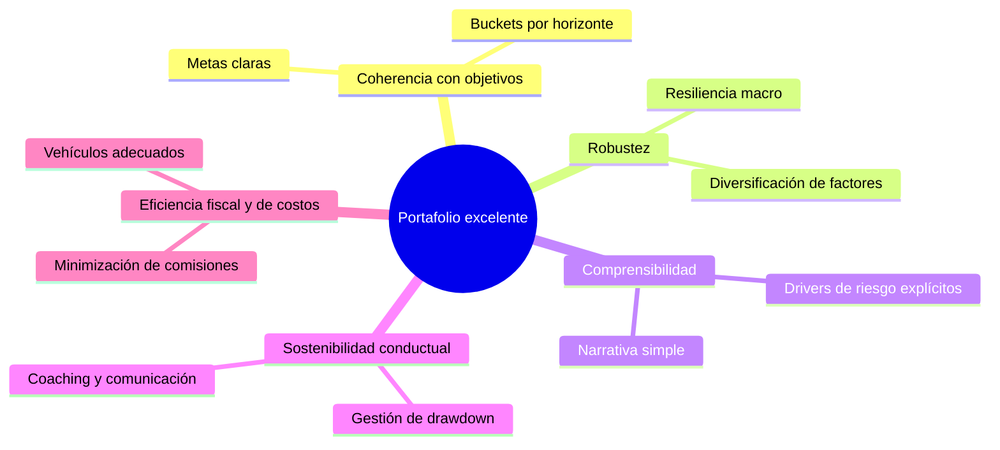

# AFI Methodology Volumen I: First Principles para el Diseño de un Multi Family Office de Clase Mundial en 2026

## Resumen ejecutivo

Este informe sintetiza evidencia académica, mejores prácticas institucionales y principios de ciencias de la decisión para responder a una pregunta central: ¿cómo debería pensar un Multi Family Office (MFO) de clase mundial si fuera diseñado completamente desde cero en 2026? La respuesta se construye desde first principles y se organiza en diez bloques temáticos: función económica del MFO, significado de gestionar patrimonio, objetivo del wealth manager, filosofía de toma de decisiones, filosofía de asset allocation, principios de construcción de portafolios, rol del asesor, filosofía de monitoreo, gestión del conocimiento organizacional y principios universales de wealth management institucional.

La literatura de CFA Institute sobre Private Wealth Management enfatiza que la función del asesor no es maximizar retornos absolutos ni batir índices, sino maximizar la riqueza después de impuestos y probabilidades de cumplir objetivos vitales del cliente, considerando su capital humano, restricciones, preferencias y sesgos. La evidencia sobre goal-based investing y behavioural finance muestra que las decisiones de los individuos se organizan en torno a metas heterogéneas y cuentas mentales, y que los sesgos (aversión a la pérdida, sobreconfianza, sesgo de corto plazo) deterioran la implementación rigurosa de portafolios óptimos si no se gestionan explícitamente.[^1][^2][^3][^4][^5]

Las grandes instituciones (BlackRock, Vanguard, Bridgewater, Mercer, Cambridge Associates, JP Morgan Private Bank, UBS, Morgan Stanley) convergen en algunos principios robustos: primacía de la asset allocation estratégica como fuente principal de resultados; enfoque multiobjetivo y multihorizonte; disciplina de proceso por sobre apuestas discrecionales; diversificación amplia por factores, riesgos y horizontes; integración explícita de impuestos, liquidez y gobernanza; y uso sistemático de tecnología y gestión de conocimiento para asegurar consistencia.[^6][^7][^8][^9][^10][^11]

Desde la perspectiva de ciencias de la decisión, el MFO óptimo se concibe como un sistema socio-técnico: combina modelos normativos (expected utility, mean–variance, risk parity, Black–Litterman) con heurísticas adaptativas (adaptive markets, goal-based, reglas de rebalancing y escalamiento de riesgo) y con procesos organizacionales que mitigan bounded rationality y sesgos individuales. El capítulo final articula los "First Principles of Institutional Wealth Management" como base filosófica y metodológica sobre la cual se podrá construir posteriormente la Metodología AFI.[^12][^13][^14][^15][^16]

## Principales hallazgos

- El verdadero problema que resuelve un MFO es la transformación de riqueza financiera, humana y social dispersa en decisiones intertemporales coherentes bajo incertidumbre, corrigiendo fallas de mercado ligadas a información, racionalidad limitada, escala y gobernanza familiar.[^2][^17][^18]
- Gestionar patrimonio implica coordinar múltiples dimensiones: bienestar económico, seguridad financiera, continuidad intergeneracional, coherencia identitaria de la familia, resiliencia frente a shocks y sostenibilidad fiscal y jurídica del patrimonio.[^1][^2]
- El objetivo normativo del wealth manager es maximizar la utilidad intertemporal esperada del conjunto familiar, sujeta a restricciones de capital humano, liquidez, impuestos y tolerancia a la pérdida; en la práctica, esto se operacionaliza como maximizar la probabilidad de cumplir metas críticas (goal-based) más que maximizar retorno medio o minimizar varianza.[^3][^4][^2][^1]
- Las decisiones de inversión deben tomarse mediante marcos que integren expected utility, prospect theory, bounded rationality y adaptive markets, combinando modelos cuantitativos con estructuras de gobierno que reduzcan sesgos conductuales y errores repetitivos.[^13][^14][^19]
- La filosofía de asset allocation robusta prioriza: enfoque estratégico de largo plazo basado en capital market assumptions; uso prudente de tácticas; diversificación por factores de riesgo y por estados del mundo (crecimiento/inflación); y gestión explícita de presupuestos de riesgo y liquidez.[^20][^8][^16][^9]
- Un buen portafolio se caracteriza por coherencia con los objetivos, robustez a múltiples escenarios, diversificación de riesgos relevantes, capacidad de ser comprendido por el cliente y gobernado por la organización, y por minimizar errores sistemáticos más que perseguir retornos máximos en un único estado del mundo.[^7][^21][^6]
- El asesor institucional actúa como arquitecto de decisiones, no como selector de activos individuales: traduce objetivos en políticas, diseña marcos de asset allocation, gestiona expectativas y disciplina comportamientos, y opera dentro de una metodología común que transforma experiencia individual en criterio institucional.[^22][^2]
- El monitoreo tiene por finalidad verificar la alineación permanente entre portafolio, objetivos y parámetros de riesgo, distinguiendo entre ruido de mercado y cambios estructurales en circunstancias del cliente o en el entorno macro; la literatura advierte contra el exceso de intervención y el market timing discrecional.[^16][^9][^6]
- Las instituciones líderes de asset y wealth management invierten intensamente en gestión de conocimiento: estandarizan creencias de inversión, documentan procesos, usan plataformas tecnológicas (p.ej., Aladdin) para capturar datos y decisiones, y entrenan asesores en marcos conceptuales comunes para asegurar consistencia global.[^10][^11]

## 1. ¿Qué problema resuelve realmente un Multi Family Office?

### Fundamento económico

Desde la teoría de organización industrial y finanzas del hogar, los individuos enfrentan información incompleta, costos de transacción elevados y habilidades limitadas para tomar decisiones óptimas de portafolio y planificación patrimonial. Un MFO mitiga estas fallas de mercado al ofrecer economías de escala en análisis, acceso a vehículos institucionales, coordinación fiscal y legal, y diseño de decisiones intertemporales que internalizan capital humano y riesgos no negociables.[^17][^18][^2][^1]

En términos de teoría de agencia, el MFO actúa como agente fiduciario que reduce problemas de principal–agente en la relación familia–gestores externos y en la propia organización familiar, diseñando estructuras de gobierno que alinean incentivos y controlan conflictos intra-familiares y entre generaciones. Esto corrige fallas de coordinación que llevan, en ausencia de asesoría especializada, a decisiones miopes o contradictorias respecto del patrimonio global.[^2][^1]

### Fundamento financiero

La evidencia en household finance muestra que, sin asesoría, la mayoría de los hogares sub-diversifican, tienen sesgos de home bias y underparticipation en mercados de riesgo, y mantienen estructuras fiscales ineficientes. El MFO agrega valor diseñando portafolios diversificados y fiscalmente eficientes, integrando activos líquidos con activos privados y empresariales, y estructurando vehículos que maximizan after-tax wealth de acuerdo con el marco de Private Wealth Management del CFA Institute.[^18][^23][^17][^2]

Además, coordina múltiples gestores y vehículos (fondos, mandatos separados, alternativas) para evitar duplicaciones de riesgo y concentraciones inadvertidas, algo difícil de lograr para familias que interactúan directamente con numerosos proveedores sin una visión holística.

### Fundamento estadístico

Desde Markowitz, la teoría de portafolio demuestra que el enfoque en activos individuales conduce a portafolios ineficientes; el valor se genera mediante combinación de activos con correlaciones imperfectas para minimizar varianza dada una rentabilidad esperada. La literatura posterior en asset allocation y risk budgeting muestra que la mayoría de los resultados de largo plazo provienen de la estructura de asset allocation más que de selección táctica de títulos.[^24][^8][^6][^12]

Un MFO profesionaliza este problema al operar sobre el espacio de distribuciones conjuntas de retornos y riesgos, utilizando herramientas como mean–variance, modelos de factores, Black–Litterman y enfoques de riesgo-paridad para conseguir portafolios más balanceados que los que construiría un inversor no especializado.[^15][^9][^16]

### Fundamento conductual

La behavioural finance documenta que inversionistas individuales exhiben sobreconfianza, aversión a la pérdida, seguimiento de tendencias y sesgos de disposición que deterioran retornos ajustados por riesgo. El MFO agrega valor como "coach conductual", ayudando a mantener disciplina frente a volatilidad, a evitar ventas en mínimos y compras en máximos, y a alinear la percepción de riesgo con la verdadera capacidad de soportar pérdida.[^19][^3][^13]

Goal-based investing y mental accounting muestran que las familias piensan en metas separadas (liquidez, estilo de vida, legado, crecimiento) y asignan intuitivamente recursos a cuentas mentales; el MFO traduce esta realidad conductual en una arquitectura formal de portafolios por objetivos que hace compatible la racionalidad económica con la psicología del cliente.[^4][^5][^3]

### Fundamento organizacional

Las familias empresarias de alto patrimonio suelen carecer de estructuras formales de decisión y de procesos documentados para gestionar su riqueza; la literatura sobre gobierno familiar subraya la necesidad de instancias técnicas que separen decisiones de inversión de conflictos afectivos y políticos. El MFO actúa como organización intermediaria que aporta procesos, comités, métricas y documentación, transformando decisiones idiosincráticas en políticas estables.[^1][^2]

Instituciones como Mercer y Cambridge Associates señalan explícitamente que la asset allocation es la decisión más importante y que una gobernanza clara en torno a beliefs de inversión y políticas mejora resultados y reduce errores repetitivos.[^8][^11]

### Evidencia empírica

- Estudios en household finance muestran que educación financiera y asesoría profesional se asocian con mayor participación en mercados de capital, mejor diversificación y mayores ratios de riqueza sobre ingreso.[^23][^17]
- Vanguard, en su marco de "Advisor’s Alpha", estima que la asesoría integral puede agregar aproximadamente 3% anual de valor mediante mejor asset allocation, disciplina de rebalancing, eficiencia de costos y coaching conductual.[^22]
- CFA Institute documenta que la integración de planificación patrimonial, gestión fiscal y portafolio estructurado aumenta la probabilidad de alcanzar metas financieras a lo largo del ciclo de vida.[^2][^1]

### Limitaciones y contexto de validez

El valor agregado del MFO depende críticamente de su independencia, capacidad técnica y gobernanza; estructuras con conflictos de interés significativos (retrocesiones, venta de productos propios sin due diligence independiente) pueden destruir valor. Además, en entornos donde los mercados son poco profundos o los instrumentos son limitados, la sofisticación de modelos puede tener rendimientos marginales decrecientes.[^2]

El MFO agrega más valor en contextos de mayor complejidad: patrimonios altos, presencia de empresas familiares, jurisdicciones fiscales múltiples, metas intergeneracionales y exposición a activos privados; en patrimonios simples con objetivos básicos, soluciones estandarizadas o robo-advisors pueden ser suficientes.[^6][^2]

## 2. ¿Qué significa gestionar patrimonio?

### Perspectiva económica

Gestionar patrimonio es administrar el flujo intertemporal de consumo, inversión y legado de una familia, integrando capital humano (capacidad de generar ingresos futuros), capital financiero, capital social y capital reputacional. La noción de "extended balance sheet" del CFA Institute incluye activos explícitos (portafolios, empresas, inmuebles) e implícitos (ingresos futuros, beneficios de seguridad social) y pasivos explícitos e implícitos (gastos de estilo de vida, compromisos familiares).[^1][^2]

Desde la teoría del ciclo de vida, la gestión patrimonial busca suavizar consumo, asegurar contra shocks adversos y maximizar bienestar a lo largo de generaciones, sujeto a restricciones de mercados incompletos y riesgos no asegurables. Esto implica decidir cuánto riesgo tomar, qué proporción consumir, cuánto transferir a futuras generaciones y cómo financiar objetivos como educación, filantropía y sucesión empresarial.[^23]

### Perspectiva financiera

En finanzas, gestionar patrimonio significa diseñar, implementar y mantener una estructura de activos y pasivos que maximice after-tax wealth ajustado por riesgo y liquidez, consistente con objetivos de gasto y legado. Incluye decisiones sobre:[^2]

- Estructura de asset allocation (liquidez, renta fija, acciones, alternativas, activos privados).
- Uso de apalancamiento prudente y deuda.
- Implementación en vehículos específicos (fondos, mandatos, seguros, trusts, estructuras offshore).
- Gestión de riesgo de mercado, crédito, liquidez y contraparte.

Instituciones como BlackRock enfatizan la construcción de portafolios resilientes que integren escenarios de crecimiento e inflación, y Vanguard sintetiza la gestión patrimonial en principios de metas claras, balance adecuado, costos bajos y disciplina.[^21][^20][^10]

### Perspectiva estratégica

Desde estrategia, gestionar patrimonio es alinear recursos financieros con la estrategia vital y empresarial de la familia: expansión de negocios, diversificación geográfica, construcción de activos de influencia (filantropía, impacto social), preservación de independencia financiera y resiliencia frente a shocks macro o tecnológicos.[^11][^1]

La literatura sobre endowments (Swensen en Yale) destaca la importancia de una visión de muy largo plazo, tolerancia a la iliquidez, diversificación amplia y gobernanza sólida para soportar volatilidad y crisis sin desviar la estrategia fundamental. Estas ideas son directamente extrapolables al contexto de familias con patrimonios significativos.[^25][^11]

### Perspectiva conductual

Gestionar patrimonio implica gestionar las emociones, narrativas y sesgos que rodean el dinero dentro de la familia: aversión a la pérdida, miedo a la escasez pese a abundancia, rivalidades entre herederos, culpa asociada a riqueza heredada y sesgos de status quo. Goal-based planning y frameworks como los de JP Morgan Private Bank y Morgan Stanley enfatizan la necesidad de articular "para qué" es la riqueza: liquidez, estilo de vida, legado, crecimiento.[^5][^26][^27][^4][^13][^19]

Esta claridad reduce decisiones reactivas y facilita la aceptación de portafolios que, aunque volátiles en el corto plazo, son coherentes con objetivos profundos.

### Perspectiva intergeneracional

La gestión patrimonial intergeneracional incorpora la dimensión temporal extendida: cómo asegurar que el patrimonio financie proyectos y estilos de vida de varias generaciones sin caer en dilución excesiva ni en conflictos destructivos. Implica diseñar políticas de gasto, reglas de herencia, estructuras de gobierno familiar, vehículos de protección (trusts, fundaciones) y programas de educación financiera y de valores.[^1][^2]

Los endowments universitarios ofrecen evidencia de que marcos explícitos de política de gasto (por ejemplo, reglas de spending basadas en porcentajes del valor del fondo) permiten preservar capital real a lo largo del tiempo, lección aplicable al diseño de políticas de gasto familiar.[^25][^11]

### Perspectiva organizacional

Gestionar patrimonio es también gestionar una organización: el MFO y la familia constituyen un sistema organizativo donde se toman decisiones, se delegan funciones, se establecen comités y se formalizan responsabilidades. La consistencia metodológica exige arquitectura de procesos (IPS, comités de inversión, comités de riesgo, protocolos de rebalancing, marcos de due diligence) que trascienden a individuos específicos.[^11][^2]

Instituciones como BlackRock, UBS y JP Morgan Private Bank ilustran la importancia de una "house view" central, capital market assumptions comunes y procesos de recomendación que canalizan opiniones individuales dentro de una estructura coherente.[^28][^29][^10]

## 3. ¿Cuál debería ser el verdadero objetivo de un Wealth Manager?

### Evidencia científica

La teoría de expected utility y el enfoque de ciclo de vida sugieren que el objetivo normativo es maximizar la utilidad esperada del consumo intertemporal de los individuos, sujeta a restricciones de riqueza, ingresos, preferencias y riesgo. Esto implica decisiones sobre ahorro, inversión y seguro que maximizan bienestar, no simplemente retorno financiero.[^18][^23]

Prospect theory añade que los individuos son más sensibles a pérdidas que a ganancias, por lo que la forma en que se presentan y experimentan los resultados afecta la satisfacción y la adherencia a la estrategia. Goal-based investing reinterpreta el problema como maximizar probabilidades de cumplir metas específicas (por ejemplo, financiar educación, asegurar un nivel de gasto mínimo, dejar un legado determinado).[^3][^13][^19][^1]

CFA Institute establece explícitamente que el objetivo primario del wealth manager es maximizar la riqueza después de impuestos mientras se consideran las metas del cliente, su tolerancia y capacidad de riesgo, y sus restricciones. Esto integra dimensiones de utilidad económica (consumo), seguridad psicológica (tolerancia a pérdidas) y objetivos de legado.[^2]

### Consenso de la industria

Los principales actores de wealth management institucional (JP Morgan Private Bank, UBS, Morgan Stanley, Vanguard) convergen en un marco de objetivos centrado en metas:[^27][^21][^5][^28]

- Focalizarse en "lo que la riqueza debe lograr" más que en batir índices.
- Organizar el patrimonio en lentes o buckets (liquidez, estilo de vida, legado, crecimiento).
- Medir el éxito como probabilidad de alcanzar metas, manteniendo disciplina frente a volatilidad.

Vanguard, en "Principles for Investing Success" y "Advisor’s Alpha", enfatiza que el mayor valor del asesor surge de ayudar al cliente a definir objetivos claros, construir portafolios apropiados, minimizar costos y mantener la disciplina; la maximización de retornos es subordinada a la coherencia con los objetivos y al control de riesgos relevantes.[^7][^21][^22]

### Opinión fundamentada

Un wealth manager de clase mundial debería tener como objetivo primario maximizar la utilidad intertemporal de la familia cliente, operacionalizada como:

- Maximizar la probabilidad de alcanzar metas críticas (seguridad financiera, proyectos vitales, legado).
- Minimizar la probabilidad y severidad de resultados inaceptables (ruina, ventas forzadas, conflictos patrimoniales).
- Optimizar la eficiencia fiscal y de costos para que el máximo de retorno bruto se traduzca en retorno neto disponible.
- Mantener coherencia entre estrategia financiera y valores de la familia (impacto, sostenibilidad, reputación).

Maximizar retorno aislado, minimizar riesgo absoluto o preservar patrimonio sin referencia a metas específicas son objetivos parciales que pueden llevar a decisiones subóptimas. El equilibrio entre retorno, riesgo, liquidez, impuestos y estabilidad emocional del cliente es el verdadero objetivo, integrando expected utility y goal-based investing.

### Limitaciones y contexto

- La utilidad es difícil de observar y modelar; el wealth manager debe usar aproximaciones pragmáticas (metas, cuestionarios, diálogo) que pueden ser ruidosas.[^4][^2]
- Metas pueden cambiar con el tiempo; la gestión debe ser dinámica y adaptativa.
- En contextos de muy alta riqueza, la maximización de retorno puede jugar un rol mayor en proyectos de impacto o filantropía, pero siempre dentro de la tolerancia al riesgo de la familia.

## 4. Filosofía de toma de decisiones bajo incertidumbre

### Decision Science y bounded rationality

Herbert Simon introdujo el concepto de bounded rationality: los agentes buscan soluciones satisfactorias dado conocimiento, capacidad computacional y tiempo limitados, más que óptimos globales. La ciencia de la decisión moderna integra este enfoque con modelos normativos y heurísticos, reconociendo que las organizaciones necesitan procesos para compensar limitaciones individuales.[^14]

En un MFO, esto implica diseñar:

- Procesos de decisión estructurados (comités, agendas, criterios de aprobación).
- Herramientas de apoyo (modelos, dashboards, simulaciones Monte Carlo) que faciliten decisiones informadas.[^6][^1]
- Reglas simples y robustas (por ejemplo, bandas de rebalancing, límites de concentración) que funcionen bien en múltiples escenarios, en línea con la literatura de heurísticas adaptativas.[^14]

### Prospect theory y behavioural finance

Prospect theory muestra que los individuos evalúan resultados en términos de cambios respecto de un punto de referencia, son aversos a la pérdida y exhiben sensibilidad decreciente a cambios marginales. Esto explica comportamientos como mantener pérdidas demasiado tiempo, vender ganancias rápidamente y preferir estrategias que evitan la sensación de pérdida aun si sacrifican retorno esperado.[^13][^19]

La integración de estos hallazgos en wealth management implica:

- Diseñar marcos de comunicación y reporting que minimicen la saliencia de pérdidas irrelevantes y enfatizen progreso hacia metas.[^5][^4]
- Usar cuentas mentales de manera consciente: separar portafolios para metas críticas de aquellos para metas aspiracionales, reduciendo la tentación de intervenir por emociones coyunturales.[^3]
- Implementar coaching conductual sistemático para ayudar a los clientes a mantener el rumbo.

### Expected utility, goal-based investing y adaptive markets

Expected utility provee el marco normativo clásico: maximizar utilidad esperada dada distribución de resultados. Goal-based investing traduce este marco a metas discretas, cada una con su función de utilidad específica (por ejemplo, altísima aversión a no financiar necesidades básicas, menor aversión en metas de lujo).[^12][^4][^23][^3][^1]

Andrew Lo, con la Adaptive Markets Hypothesis, argumenta que los mercados y los agentes se comportan de manera evolutiva: estrategias que funcionan en un entorno pueden dejar de hacerlo cuando cambian condiciones; los agentes aprenden, adaptan y compiten. Un MFO diseñado en 2026 debe incorporar esta visión:[^30][^14]

- Sus modelos no pueden ser estáticos; deben ser revisados periódicamente a la luz de nueva evidencia.
- Debe combinar reglas invariantes (diversificación, control de costos, disciplina) con flexibilidad táctica moderada.[^20][^16]

### Organizational decision making

Las decisiones en un MFO no son individuales sino colectivas: CIO, comité de inversión, asesores, familia cliente. La literatura organizacional enfatiza la necesidad de:

- Claridad en roles y responsabilidades.
- Procesos de deliberación que integren perspectivas cuantitativas y cualitativas.[^11]
- Documentación sistemática de decisiones y racionales para aprendizaje futuro.

Plataformas como BlackRock Aladdin ejemplifican cómo la tecnología puede capturar datos, decisiones y riesgos de manera centralizada, facilitando decisiones coherentes a escala global. Bridgewater, por su parte, ha divulgado principios organizacionales de transparencia radical y registro sistemático de decisiones con evaluación ex post para mejorar el proceso.[^31][^9][^10]

### Principios robustos de decisión

A partir de estas literaturas, emergen principios que deberían guiar la toma de decisiones de un MFO:

- Separar claramente diagnóstico (qué está pasando) de pronóstico (qué podría pasar) y de decisión (qué hacer).
- Basar decisiones en distribuciones de escenarios, no en puntos únicos.
- Priorizar la coherencia con objetivos sobre la predicción de corto plazo.
- Internalizar sesgos conductuales en el diseño de procesos (por ejemplo, reglas de espera antes de decisiones grandes, uso de checklists).[^4][^13]

### Diagrama conceptual (Mermaid)

```mermaid
flowchart TD
    A[Objetivos de la familia] --> B[Diagnóstico de situación]
    B --> C[Modelos cuantitativos
(Expected Utility, escenarios)]
    B --> D[Factores conductuales
(Prospect Theory, sesgos)]
    C --> E[Opciones de decisión]
    D --> E
    E --> F[Comité de inversión
Proceso organizado]
    F --> G[Implementación
(portafolios, vehículos)]
    G --> H[Monitoreo
(resultados vs metas)]
    H --> B
```

## 5. Filosofía de Asset Allocation

### Evidencia científica

Markowitz estableció que la combinación de activos con correlaciones imperfectas permite mejorar el trade-off riesgo–retorno; la selección de portafolios eficientes depende de estimaciones de retornos esperados y matriz de covarianzas. Investigaciones posteriores muestran que errores de estimación en retornos pueden hacer que optimizaciones puras sean inestables y poco robustas.[^24][^15][^12]

Modelos como Black–Litterman integran views subjetivos con información implícita en el mercado para producir estimaciones más estables de retornos esperados. Risk parity, desarrollado por Bridgewater y analizado por AQR, enfatiza la asignación basada en contribuciones de riesgo en lugar de pesos de capital, buscando balancear el portafolio frente a diferentes estados de crecimiento e inflación.[^32][^9][^15][^16]

### Consenso de la industria

Mercer sintetiza sus creencias de inversión afirmando que la asset allocation es la decisión más importante y principal driver de retornos y riesgos. BlackRock propone frameworks de strategic asset allocation que incorporan capital market assumptions, objetivos específicos de cada tipo de inversor y resiliencia frente a diferentes estados macro.[^8][^10][^20]

Vanguard y Morningstar recomiendan portafolios ampliamente diversificados por clases de activos, manteniendo costos bajos y ajustando la exposición al riesgo según horizonte y tolerancia. Bridgewater y AQR abogan por estructuras balanceadas (risk parity, all weather) que no dependan de acertar el entorno económico futuro.[^9][^21][^16][^7][^4]

### Principios que sobreviven al modelo específico

Independientemente de que se use strategic/tactical, endowment model, core–satellite, factor investing, risk budgeting, risk parity o Black–Litterman, emergen principios universales:

- **Primacía del enfoque estratégico:** la estructura de largo plazo del portafolio, basada en objetivos y horizonte, explica la mayoría de los resultados; las tácticas agregan valor marginal y deben estar acotadas por presupuestos de riesgo.[^20][^8]
- **Diversificación por factores de riesgo:** más importante que la diversificación por número de activos es la diversificación por exposición a factores como renta variable global, tipos de interés, inflación, crédito, iliquidez, factores de estilo (value, momentum, quality).[^16][^9]
- **Consistencia con objetivos y restricciones:** la asset allocation debe derivarse de metas (goal-based) y de restricciones de liquidez, tolerancia a drawdowns y horizonte; un endowment puede sostener iliquidez significativa, una familia no siempre.[^11]
- **Gestión explícita de riesgo:** uso de medidas ex ante (volatilidad, drawdown esperado, stress tests) y de presupuestos de riesgo por tipo de activo o estrategia.[^10][^16]
- **Disciplina de rebalancing:** mantener bandas de rebalanceo para evitar drift excesivo y capturar primas de rebalanceo en entornos volátiles.[^7][^6]

### Matriz comparativa de enfoques de asset allocation

| Enfoque | Fundamento científico | Ventajas principales | Riesgos/limitaciones |
|--------|-----------------------|----------------------|----------------------|
| Strategic Asset Allocation | Mean–variance, capital market assumptions.[^12][^20] | Claridad, estabilidad, alineación con objetivos de largo plazo. | Sensible a estimaciones de retornos; riesgo de ignorar cambios estructurales. |
| Tactical Asset Allocation | Views macro, modelos predictivos.[^10] | Posible captura de oportunidades de corto plazo. | Riesgo de market timing, dependencia de skill, sesgos conductuales. |
| Endowment Model | Horizonte largo, tolerancia a iliquidez.[^11][^25] | Acceso a primas de iliquidez, diversificación amplia en alternativas. | Necesita gobernanza fuerte; liquidez limitada ante shocks. |
| Core–Satellite | Teoría de portafolio, gestión pasiva + activa.[^6] | Núcleo estable, espacio controlado para estrategias activas. | Complejidad operacional, riesgo de sobrecarga de productos. |
| Factor Investing | Anomalías sistemáticas (value, momentum).[^16] | Exposición dirigida a fuentes de retorno estructurales. | Factores pueden dejar de pagar; ciclos largos de underperformance. |
| Risk Budgeting | Asignación por contribución de riesgo.[^16] | Control fino del perfil de riesgo, coherencia con objetivos. | Requiere medición robusta de riesgos; sensible a correlaciones. |
| Risk Parity | Igual contribución de riesgo, balance macro.[^9][^16][^32] | Alta diversificación, resiliencia a diferentes entornos. | Dependencia de bonos y de apalancamiento; puede quedar rezagado en bull markets accionarios. |
| Black–Litterman | Integración views–mercado.[^15] | Retornos esperados más estables, menos sensibilidad a errores. | Requiere views bien fundamentados; complejidad de implementación. |

### Diagrama conceptual de asset allocation por estados del mundo

```mermaid
quadrantChart
    title Asset Allocation por estados de crecimiento/inflación
    x-axis Inflación baja ---- Inflación alta
    y-axis Crecimiento bajo ---- Crecimiento alto
    quadrant-1 Crecimiento alto,
Inflación baja
    quadrant-2 Crecimiento alto,
Inflación alta
    quadrant-3 Crecimiento bajo,
Inflación alta
    quadrant-4 Crecimiento bajo,
Inflación baja
    "Acciones globales" : 0.8 : 0.9
    "Bonos nominales" : -0.6 : -0.7
    "Bonos ligados a inflación" : -0.3 : 0.4
    "Commodities" : 0.4 : 0.8
    "Cash" : -0.2 : -0.3
```

*(Los valores son ilustrativos: el principio es mapear cada clase de activo a estados de crecimiento e inflación, buscando balance.)*

## 6. ¿Qué significa construir un buen portafolio?

### Desde principios, no métricas

La literatura clásica enfatiza métricas como Sharpe ratio, tracking error y maximum drawdown; sin embargo, desde first principles un "buen" portafolio se caracteriza por:

- **Coherencia teleológica:** está diseñado explícitamente para lograr metas específicas y su estructura refleja estas metas (por ejemplo, bucket de liquidez para gastos inmediatos, bucket de crecimiento para metas de largo plazo).[^3][^1]
- **Robustez:** funciona razonablemente bien en una amplia gama de escenarios macro, no depende de un único estado del mundo para ser aceptable.[^9][^16]
- **Comprensibilidad:** puede ser explicado en términos claros al cliente; la familia entiende los drivers fundamentales de riesgo y retorno.[^5][^4]
- **Sostenibilidad comportamental:** está diseñado de manera que la familia pueda tolerar sus fluctuaciones sin abandonar la estrategia en momentos críticos (gestión de drawdown y comunicación).[^19][^13]
- **Eficiencia fiscal y de costos:** minimiza costos innecesarios y diseña la ubicación de activos de forma que, dada la jurisdicción, el retorno neto se maximice.[^22][^2]

### Errores estructurales

Errores que derivan de principios mal planteados incluyen:

- **Concentración excesiva no remunerada:** portafolios con alta exposición a un solo activo o sector sin justificación ligada a capital humano o información privada.[^18]
- **Falta de diversificación de factores:** portafolios que aparentan diversificación por número de fondos pero en realidad concentran riesgo en un mismo factor (por ejemplo, value US large cap).[^16]
- **Desalineación con objetivos:** por ejemplo, portafolios muy volátiles para metas de corto plazo, o demasiado conservadores para metas de largo plazo que requieren crecimiento.[^3][^1]
- **Ignorar liquidez e iliquidez:** sobrecargar el portafolio de activos ilíquidos sin considerar necesidades de gasto y colaterales para otras actividades.[^11]

### Errores provenientes de sesgos humanos

Además de errores estructurales, la literatura identifica errores sistemáticos originados en sesgos:[^13][^19][^3]

- **Home bias:** sobrepeso en activos locales por familiaridad, reduciendo diversificación global.[^18]
- **Sesgo de disposición:** vender activos que han subido demasiado pronto y mantener perdedores, reduciendo exposición a primas de riesgo.
- **Sobreconfianza y exceso de rotación:** trading innecesario con costos altos y sin mejora de performance.
- **Sesgo de recencia:** extrapolar resultados recientes al futuro y ajustar portafolios de forma pro-cíclica.

Un MFO debe diseñar portafolios y procesos para mitigar estos errores mediante reglas, educación y reporting.

### Marco conceptual de "portafolio excelente"



## 7. Rol del asesor

### Evidencia científica y profesional

CFA Institute enfatiza que el asesor privado debe combinar habilidades técnicas (mercados, portafolio, planificación, cuantitativo, tecnología) con habilidades blandas (comunicación, educación, coaching). Vanguard, en Advisor’s Alpha, identifica el coaching conductual, la definición de asset allocation adecuada, la implementación eficiente y el rebalancing como principales fuentes de valor.[^22][^2]

### Función económica del asesor institucional

El asesor institucional no es, en este contexto, un stock picker. Su función económica es:

- Traducir objetivos vitales de la familia en políticas formales de inversión y gasto (IPS, política de spending).[^33][^1]
- Diseñar la arquitectura de portafolios y seleccionar gestores y vehículos consistentes con la filosofía de inversión del MFO.[^8][^6]
- Proveer governance conductual: ayudar al cliente a decidir cuándo no hacer nada, protegerlo de sus propios sesgos.[^13][^22]
- Actuar como nodo de coordinación entre especialistas fiscales, legales, de seguros y de inversión.

### Decisiones que no deben automatizarse completamente

La evidencia sugiere que ciertas decisiones requieren juicio humano persistente:

- **Definición de objetivos vitales:** requiere diálogo profundo, comprensión de valores, dinámicas familiares y trade-offs no cuantificables.[^4][^5]
- **Gestión de crisis y eventos extremos:** decisiones frente a enfermedad, divorcio, venta de empresa familiar, cambios regulatorios mayores.
- **Prioridad entre metas en conflicto:** asignación de recursos limitados entre proyectos diferentes con cargas emocionales significativas.
- **Elección de gobernanza familiar:** diseño de estructuras de sucesión y políticas de gasto.

Estas decisiones implican dimensiones éticas y emocionales que modelos no pueden capturar plenamente.

### Tareas que sí deberían sistematizarse

En contraste, múltiples tareas son candidatas claras a sistematización mediante metodologías y sistemas:

- **Diagnóstico financiero estándar:** captura de información patrimonial, elaboración de extended balance sheet, análisis de liquidez.[^1][^2]
- **Simulación de escenarios y capital sufficiency:** uso de Monte Carlo para evaluar probabilidad de cumplir metas bajo diferentes estrategias.[^2]
- **Definición de asset allocation base:** reglas basadas en horizonte, tolerancia, capital humano y metas (goal-based buckets).[^7][^1]
- **Rebalancing periódico y controles de riesgo:** algoritmos que ejecutan reglas definidas por el comité de inversión.[^6][^16]
- **Due diligence inicial sobre gestores y vehículos:** checklists y scoring cuantitativo, complementados por juicio cualitativo final.

### Transformación de experiencia individual en criterio institucional

Organizaciones como BlackRock, Bridgewater y grandes bancos privados convierten experiencia de individuos en metodología mediante:[^31][^10][^11]

- Documentación sistemática de decisiones y racionales (investment memos, minutes de comités).
- Desarrollo de "investment beliefs" y "house views" que codifican conclusiones de experiencia y evidencias.
- Plataformas tecnológicas que capturan datos de portafolios, riesgos y performance para análisis ex post.
- Programas de formación continua para asesores, basados en cuerpos de conocimiento estándar (CFA, CAIA) y en material propio.

Un MFO de clase mundial debería institucionalizar procesos similares para que criterios no dependan de personas específicas.

## 8. Filosofía de monitoreo

### ¿Por qué se monitorean portafolios?

La literatura de portfolio management describe el monitoreo como etapa esencial posterior a la implementación: verificar que el portafolio sigue alineado con la IPS, que las bandas de riesgo y concentración se respetan, y que cambios en circunstancias del cliente se reflejan en la estrategia.[^6][^2]

Monitorear sirve para:

- Detectar drift de asset allocation por movimientos de mercado que requieren rebalanceo.
- Identificar desviaciones significativas respecto de supuestos iniciales (por ejemplo, cambios en volatilidades o correlaciones).
- Integrar eventos de vida del cliente (cambios de ingresos, salud, estructura familiar) que alteran perfil de riesgo y metas.

### Eventos que justifican revisar una estrategia

Evidencia y práctica sugieren que revisiones profundas de estrategia se justifican cuando:[^6][^2]

- Cambian significativamente las circunstancias del cliente: venta de empresa, herencia grande, divorcio, diagnóstico médico serio.
- Cambia el horizonte de tiempo de metas clave: adelanto o retraso de jubilación, redefinición de proyectos familiares.
- Cambian las condiciones estructurales de mercado: cambios en régimen de inflación, niveles de tasas persistentemente distintos, alteraciones regulatorias significativas.

Movimientos de mercado de corto plazo, incluso fuertes, rara vez justifican cambios estratégicos si los supuestos de largo plazo y las metas permanecen estables.[^9][^16]

### ¿Cuándo no debería modificarse un portafolio?

Un principio robusto es evitar modificaciones motivadas por:

- Reacciones emocionales a volatilidad de corto plazo sin cambios en horizonte o objetivos.[^19][^13]
- Noticias de mercado sin impacto claro en supuestos fundamentales del portafolio.
- Deseo de "hacer algo" simplemente para sentir control.

La literatura sobre risk parity y all weather muestra que portafolios diseñados para soportar múltiples entornos deben ser mantenidos incluso cuando un entorno particular penaliza temporalmente una clase de activos; intervenir impul­sivamente puede destruir el balance cuidadosamente construido.[^32][^9]

### Cómo evitar el exceso de intervención

- Definir bandas de rebalancing y umbrales claros para cambios tácticos (por ejemplo, desvíos de más de cierto porcentaje respecto de pesos objetivo).[^6]
- Establecer calendarios de revisión predefinidos (trimestral/semestral) para evaluar estrategia, evitando decisiones ad hoc.[^2]
- Separar claramente portafolios para metas de corto plazo (más defensivos) de aquellos para largo plazo, reduciendo la tentación de intervenir en estos últimos.[^5][^3]
- Educar a la familia sobre el rol de la volatilidad en la creación de retornos y sobre la historia de portafolios balanceados.

## 9. Gestión del conocimiento en organizaciones líderes

### Prácticas observadas

Las instituciones de referencia (BlackRock, Bridgewater, Cambridge Associates, Mercer, Morningstar, JP Morgan Private Bank, UBS, Vanguard, AQR) muestran patrones comunes en su gestión de conocimiento:[^28][^10][^16][^7][^11]

- **House views y investment beliefs:** documentos que resumen las creencias centrales sobre cómo funcionan mercados, cómo generar retorno y cómo controlar riesgo.[^10][^8]
- **Capital market assumptions y research propios:** equipos dedicados a producir estimaciones de retornos, riesgos y correlaciones, y a estudiar temáticas como factor investing, adaptive markets, comportamiento de inversores.[^16][^10]
- **Plataformas tecnológicas:** sistemas como Aladdin (BlackRock) integran datos de posiciones, riesgos, escenarios y decisiones, permitiendo que conocimiento se comparta en tiempo real entre equipos.[^10]
- **Procesos de formación continua:** programas internos que complementan certificaciones externas (CFA, CAIA) con contenido específico de la institución.[^11][^2]
- **Estructuras de comités:** comités de inversión, riesgo, producto que deliberan y registran decisiones, creando memoria institucional.

Morningstar y Vanguard, por ejemplo, producen research aplicado sobre comportamiento de clientes, goals-based investing y valor del asesor que orienta metodologías internas y herramientas para asesores.[^4][^22]

### Conversión de experiencia individual en metodología

El proceso típico incluye:[^10][^11]

1. Documentar casos y decisiones específicas (por ejemplo, manejo de crisis, evolución de portafolios en shocks históricos).
2. Analizar patrones de éxito y fracaso con métodos cuantitativos y cualitativos.
3. Destilar principios y reglas (por ejemplo, límites de concentración, políticas de liquidez).
4. Formalizar estos principios en marcos (IPS tipo, guías de asset allocation, protocolos de comunicación).
5. Integrarlos en sistemas y herramientas que los asesores usan diariamente.

Esto transforma conocimiento tácito en conocimiento explícito y replicable. La cultura organizacional (por ejemplo, la de Bridgewater) fomenta feedback y evaluación constante de decisiones, acelerando aprendizaje.[^31][^9]

### Entrenamiento de asesores y consistencia

Las instituciones líderes entrenan asesores mediante:

- Programas estructurados de onboarding con exposición a house views, metodologías de planificación y herramientas tecnológicas.[^11][^2]
- Evaluación continua basada en métricas de proceso (cumplimiento de metodología) más que solo resultados de portafolio.[^22]
- Simulaciones y casos que exponen a asesores a escenarios difíciles (crisis de mercado, conversaciones complejas con clientes).

La consistencia se logra al:[^28][^10]

- Forzar que recomendaciones se basen en supuestos y parámetros comunes (CMAs, house views).
- Auditar la adherencia a procesos (por ejemplo, que toda recomendación tenga IPS actualizado y racional documentado).
- Usar sistemas que limitan discrecionalidad fuera de rangos permitidos.

## 10. Principios universales de Wealth Management institucional

A partir del análisis de literatura académica y prácticas institucionales, emergen principios que se repiten independientemente de país, tamaño, activos administrados y filosofía específica:

1. **Primacía de la alineación con objetivos:** las decisiones de portafolio deben derivarse de metas vitales del cliente, no de benchmarks externos.[^5][^3][^1]
2. **Extended balance sheet:** la planificación debe considerar capital humano, activos implícitos y pasivos futuros, no solo portafolios financieros visibles.[^23][^1]
3. **Asset allocation como decisión central:** la estructura estratégica de activos determina la mayoría de resultados de largo plazo.[^8][^6]
4. **Diversificación por factores y estados del mundo:** la verdadera diversificación se logra distribuyendo riesgo entre fuentes heterogéneas (acciones, bonos, inflación, crédito, iliquidez, estilos).[^9][^16]
5. **Disciplina de proceso sobre intuición:** el valor principal del MFO está en la consistencia metodológica y la disciplina, más que en habilidades de predicción de corto plazo.[^22][^6]
6. **Gestión explícita de impuestos y costos:** eficiencia fiscal y de costos es una fuente de alpha estructural para inversores privados.[^22][^2]
7. **Integración de behavioural finance:** la metodología debe anticipar y gestionar sesgos humanos mediante diseño de portafolios, reglas y comunicación.[^13][^3][^4]
8. **Gobernanza robusta y documentación:** IPS, comités, minutos y sistemas de registro son esenciales para transformar decisiones individuales en criterio institucional.[^33][^10]
9. **Tecnología como columna vertebral:** plataformas integradas de datos, riesgos y reporting son necesarias para escalar consistencia y control.[^10][^11]
10. **Aprendizaje continuo y adaptación:** investment beliefs y house views deben actualizarse a la luz de nueva evidencia y cambios en mercados, manteniendo principios pero revisando modelos.[^30][^14][^11]

***

# "First Principles of Institutional Wealth Management"

Este capítulo final presenta un conjunto de principios numerados que servirán como base filosófica y metodológica para la futura Metodología AFI. Están formulados para ser válidos en los próximos 10–20 años y suficientemente específicos para orientar procesos, herramientas y sistemas de apoyo a decisiones.

### Principio 1: Centralidad de los objetivos vitales

El propósito de la gestión patrimonial es maximizar la probabilidad de que la riqueza permita a la familia cumplir sus objetivos vitales (seguridad, proyectos, legado) con un nivel de riesgo emocional y financiero aceptable. Todo diseño de estrategia, portafolio o recomendación debe comenzar por una clarificación profunda y estructurada de esos objetivos.[^3][^5][^1]

### Principio 2: Visión de balance extendido

El patrimonio debe ser concebido como un balance extendido que integra capital humano, activos financieros y no financieros, pasivos explícitos e implícitos, y compromisos futuros. Las decisiones de inversión y gasto deben considerar esta estructura completa, no solo el portafolio financiero líquido.[^23][^1]

### Principio 3: Asset allocation como arquitectura del riesgo

La asset allocation estratégica es la arquitectura fundamental del riesgo y retorno del patrimonio. Debe diseñarse a partir de objetivos, horizonte, tolerancia a la pérdida, capital humano y restricciones de liquidez e impuestos, y mantenerse con disciplina a lo largo del tiempo.[^8][^6]

### Principio 4: Diversificación por factores y estados del mundo

La diversificación debe buscarse en el espacio de factores de riesgo y de estados de crecimiento e inflación, no solo en número de activos. Portafolios robustos distribuyen riesgo entre activos que se comportan de forma diferente en distintos entornos macro, reduciendo la dependencia de un solo escenario.[^16][^9]

### Principio 5: Disciplina metodológica y gobernanza

Las decisiones deben seguir metodologías explícitas (IPS, marcos de asset allocation, reglas de rebalancing, protocolos de selección de gestores) y procesos de gobernanza (comités, minutos, revisiones periódicas). La consistencia de proceso es más importante que la brillantez ocasional de decisiones aisladas.[^33][^10][^6]

### Principio 6: Integración de ciencia de la decisión y behavioural finance

La metodología debe combinar modelos normativos (expected utility, mean–variance, escenarios) con una comprensión profunda de sesgos humanos (prospect theory, mental accounting, sobreconfianza). Las estructuras de portafolio y comunicación deben diseñarse para ser psicológicamente sostenibles, reduciendo la probabilidad de decisiones destructivas.[^4][^13][^3]

### Principio 7: Eficiencia fiscal y de costos como fuente de valor estructural

Para inversores privados, la optimización de impuestos, costos de gestión y fricciones de transacción es una fuente de valor tan importante como la selección de estrategias de retorno. La metodología debe incorporar explícitamente decisiones de ubicación de activos, vehículos fiscales y control de gastos.[^22][^2]

### Principio 8: Separación entre decisiones estratégicas y tácticas

La organización debe distinguir claramente entre decisiones estratégicas de largo plazo (asset allocation, política de gasto, gobernanza) y decisiones tácticas de corto/medio plazo (ajustes de exposición, selección de gestores). Las tácticas deben operarse dentro de presupuestos de riesgo definidos y nunca comprometer la integridad de la arquitectura estratégica.[^20][^10]

### Principio 9: Rol del asesor como arquitecto de decisiones

El asesor institucional debe concebirse como arquitecto de decisiones más que como seleccionador de activos individuales. Su función es estructurar objetivos, diseñar marcos de decisión, traducir creencias de inversión en portafolios concretos, y acompañar conductualmente al cliente para mantener la disciplina.[^2][^22]

### Principio 10: Monitoreo orientado a cambios estructurales, no a ruido

El monitoreo debe distinguir entre variaciones de corto plazo propias de mercados y cambios estructurales en circunstancias del cliente o en el entorno macro. Las revisiones de estrategia deben activarse ante cambios de vida, horizonte o régimen, no ante cada fluctuación de precios.[^9][^6]

### Principio 11: Tecnología y datos como infraestructura de decisión

Sistemas integrados de datos, medición de riesgo, simulaciones y reporting son indispensables para escalar la calidad y consistencia de decisiones. La metodología debe especificar cómo se capturan, almacenan y usan datos para apoyar la toma de decisiones de asesores y comités.[^10][^11]

### Principio 12: Gestión del conocimiento y aprendizaje continuo

La organización debe invertir en convertir experiencia individual en conocimiento institucional: documentar decisiones, analizar resultados ex post, actualizar investment beliefs y house views, y entrenar asesores de forma continua. La capacidad de aprender y adaptarse es una ventaja competitiva estructural.[^31][^10][^11]

### Principio 13: Coherencia ética y fiduciaria

El MFO debe operar bajo deber fiduciario, priorizando siempre los intereses de la familia cliente por sobre los de la organización o terceros. Los principios metodológicos deben incluir mecanismos para identificar y gestionar conflictos de interés, asegurar transparencia y proteger la confidencialidad.[^2]

### Principio 14: Resiliencia intergeneracional

Las decisiones deben valorar no solo el impacto en la generación actual sino en la continuidad y salud del patrimonio familiar en el tiempo. Políticas de gasto, estructuras de herencia y composición de portafolios deben diseñarse para preservar capacidad de elección de generaciones futuras.[^1][^11]

### Principio 15: Simplicidad inteligible sobre complejidad innecesaria

Cuando múltiples soluciones ofrecen eficacia similar, deben preferirse aquellas que la familia puede entender y gobernar con claridad. La complejidad solo se justifica si agrega valor material neto y puede ser explicada de manera comprensible; de lo contrario, aumenta riesgos operacionales y conductuales.[^7][^4]

Estos first principles definen el marco filosófico y metodológico inicial sobre el cual puede construirse, en trabajos posteriores, la Metodología AFI y su implementación en sistemas inteligentes de apoyo a decisiones.

---

## References

1. [Wealth Planning](https://www.cfainstitute.org/insights/professional-learning/refresher-readings/2026/wealth-planning) - The reading first examines how wealth managers can assist clients in achieving their goals, followed...

2. [Overview of Private Wealth Management](https://www.cfainstitute.org/insights/professional-learning/refresher-readings/2026/overview-private-wealth-management) - The primary objective of private wealth managers is to maximize after-tax wealth while considering t...

3. [PRIVATE WEALTH MANAGEMENT Goals-Based Investing](https://rpc.cfainstitute.org/sites/default/files/-/media/documents/article/cfa-digest/2004/dig-v34-n3-1531-pdf.pdf)

4. [Goals-Based Investing: Digging for Deeper Goals](https://www.morningstar.com/business/insights/research/digging-deeper-for-goals) - Discover how understanding clients' deeper life motivations can drive successful financial strategie...

5. [Goals - Based Planning | J.P. Morgan Private Bank EMEA EN](https://privatebank.jpmorgan.com/eur/en/insights/wealth-planning/goal-based-planning) - Create the life and legacy you envision with a plan tailored to you. Viewing your wealth through our...

6. [Portfolio Management: An Overview](https://www.cfainstitute.org/insights/professional-learning/refresher-readings/2026/portfolio-management-overview) - In this Refresher Reading, learn to describe the steps involved in the portfolio management process ...

7. [Four principles for investment success - Vanguard](https://corporate.vanguard.com/content/corporatesite/us/en/corp/about-our-funds/how-we-invest/principles-for-investing-success.html) - Personal finance success follows four principles. Our investment philosophy helps clients assemble d...

8. [MERCER INVESTMENTS BELIEFS](https://investment-solutions.mercer.com/content/dam/mercer-subdomains/delegated-solutions/CorporatePolicies/Global%20Investments%20Beliefs.pdf) - 1. Asset allocation is the most important decision. Asset allocation strategy is the primary driver ...

9. [The All Weather Story](https://www.bridgewater.com/research-and-insights/the-all-weather-story) - January 2012. How Bridgewater Associates created the All Weather investment strategy, the foundation...

10. [Portfolio construction research | BlackRock Investment Institute](https://www.blackrock.com/ca/institutional/en/insights/portfolio-design/research) - Explore the portfolio construction research behind BlackRock's modern framework for strategic asset ...

11. [Wealth & Asset Management | Insights | Financial Services](https://www.mckinsey.com/industries/financial-services/our-insights/wealth-and-asset-management) - Read our latest research, articles, and reports on Wealth and Asset Management.

12. [PORTFOLIO SELECTION* - Markowitz - 1952](https://onlinelibrary.wiley.com/doi/10.1111/j.1540-6261.1952.tb01525.x) - por H Markowitz · 1952 · Mencionado por 71310 — The process of selecting a portfolio may be divided ...

13. [The copyright to this article is held by the Econometric ...](https://kahneman.scholar.princeton.edu/sites/g/files/toruqf3831/files/kahneman/files/prospect_theory.pdf)

14. [The Adaptive Markets Hypothesis: Market Efficiency from an ...](http://stat.wharton.upenn.edu/~steele/Courses/434/434Context/EfficientMarket/AndyLoJPM2004.pdf)

15. [[PDF] Global Portfolio Optimization](https://people.duke.edu/~charvey/Teaching/BA453_2006/Black_Litterman_Global_Portfolio_Optimization_1992.pdf)

16. [Leverage Aversion and Risk Parity](https://www.aqr.com/-/media/AQR/Documents/Insights/Journal-Article/Leverage-Aversion-and-Risk-Parity.pdf)

17. [Household Finance: Education, Permanent Income and ...](https://www.nber.org/papers/w19455) - por R Cooper · 2013 · Mencionado por 22 — This paper studies household financial choices: why are th...

18. [Wealth and Portfolio Composition: Theory and Evidence](https://www.nber.org/papers/w1468) - Founded in 1920, the NBER is a private, non-profit, non-partisan organization dedicated to conductin...

19. [Prospect Theory: An Analysis of Decision under Risk](https://web.mit.edu/curhan/www/docs/Articles/15341_Readings/Behavioral_Decision_Theory/Kahneman_Tversky_1979_Prospect_theory.pdf)

20. [Building resilience: a framework for strategic asset allocation](https://www.blackrock.com/corporate/literature/whitepaper/bii-portfolio-perspectives-december-2018.pdf) - In this Portfolio perspectives publication, we introduce a new framework for our capital market assu...

21. [Vanguard's Principles for Investing Success](https://corporate.vanguard.com/content/dam/corp/research/pdf/vanguards_principles_for_investing_success.pdf)

22. [[PDF] SUMMARY OF VANGUARD'S RESEARCH ON “ADVISOR'S ALPHA ...](https://e2djuwbzkni.exactdn.com/wp-content/uploads/2024/03/Vanguard-Study-on-3.0-Value-from-Advisors-7-2022.pdf)

23. [Household Portfolios and Retirement Saving  over the Life Cycle](https://www.nber.org/system/files/working_papers/w29881/w29881.pdf)

24. [Portfolio Selection](https://ideas.repec.org/a/bla/jfinan/v7y1952i1p77-91.html) - por H Markowitz · 1952 · Mencionado por 71310 — Harry Markowitz, 1952. "Portfolio Selection," Journa...

25. [Harvard Management Company Investment Overview | PDF](https://www.scribd.com/document/547749560/01-Investment-Management-at-Harvard-Management-Company) - The document summarizes the investment losses incurred by Harvard Management Company (HMC), which ma...

26. [Goals-based investing and advice](https://privatebank.jpmorgan.com/apac/en/services/goals-based-investing-and-advice) - Using proprietary technology, we'll take a complete picture of your financial life, and your unique ...

27. [Goals-Based Planning](https://www.morganstanley.com/what-we-do/wealth-management/morgan-stanley-goals-planning-system) - Discover Morgan Stanley's Goals Planning System. This system is built to provide investing and plann...

28. [House View | UBS Global](https://www.ubs.com/global/en/wealthmanagement/insights/chief-investment-office/house-view.html) - The UBS CIO House View examines the impact of current economic trends on asset allocation based on o...

29. [UBS CIO House View | Key messages | UBS Global](https://www.ubs.com/global/en/wealthmanagement/insights/chief-investment-office/house-view/2026/weekly-key-messages.html) - What to watch in the week ahead

30. [The Adaptive Markets Hypothesis](https://web.mit.edu/Alo/www/Papers/JPM2004_Pub.pdf)

31. [Engineering Targeted Returns and Risks](https://bridgewater.brightspotcdn.com/fa/e3/d09e72bd401a8414c5c0bdaf88bb/bridgewater-associates-engineering-targeted-returns-and-risks-aug-2011.pdf)

32. [Risk Parity & the All Weather Portfolio Explained](https://www.alternativeinvestments.ai/risk-parity-the-all-weather-portfolio-explained/) - Traditional portfolios, like the 60/40 mix of stocks and bonds, allocate capital, not risk. This cre...

33. [[PDF] ELEMENTS OF AN INVESTMENT POLICY STATEMENT FOR ...](https://rpc.cfainstitute.org/sites/default/files/-/media/documents/article/position-paper/investment-policy-statement-individual-investors.pdf)

